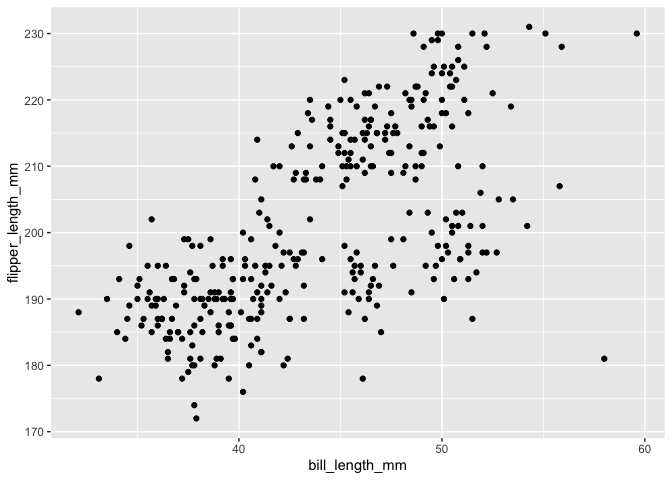

p8105_hw1_sy3269
================
Soomin You
2024-09-19

## Problem 0.1 and 0.2

This repo is for P8105 Homework 1.

``` r
library(tidyverse)
```

I loaded necessary packages (e.g. `tidyverse`).

## Problem 1

``` r
data("penguins", package = "palmerpenguins")
penguin_var = names(penguins) 
```

There are 8 variables in the penguins data set and the names are
species, island, bill_length_mm, bill_depth_mm, flipper_length_mm,
body_mass_g, sex, year.

*species*, *island*, *sex* and *year* are categorical variables, or
factor vectors.

*bill_length_mm*, *bill_depth_mm* *flipper_length_mm* and *body_mass_g*
are continuous variables. The first two are identified as double vectors
whereas the latter two are identified as integer vectors.

The data set has 344 rows and 8 columns.

``` r
mean_flipper = 
  drop_na(penguins, flipper_length_mm) |>
  pull(flipper_length_mm) |>
  mean()
```

Missing data in *flipper_length_mm* column were removed first. Then the
mean flipper length was found. The mean flipper length is 200.9152047
mm.

``` r
clean_penguins = drop_na(penguins, flipper_length_mm)

ggplot(clean_penguins, aes(x = bill_length_mm, y = flipper_length_mm, color = (species))) + 
  geom_point()
```

<!-- -->

``` r
ggsave("penguin scatterplot.pdf")
```

    ## Saving 7 x 5 in image

All missing data in penguins data set were removed before plotting.

This is a scatterplot of the clean penguins data set where x =
bill_length_mm and y = flipper_length_mm. The different species are
noted in different colors.

## Problem 2

``` r
my_df = 
  tibble(
    norm_samp = rnorm(10), 
    vec_log =  norm_samp > 0, 
    vec_char = c("apple", "banana", "cherry", "date", "eggplant", "fig", "grape", "honey", "iceberg", "jujube"),
    vec_factor = factor(c("A", "B", "C", "A", "B", "C", "A", "B", "C", "A"))
  )

my_df
```

    ## # A tibble: 10 × 4
    ##    norm_samp vec_log vec_char vec_factor
    ##        <dbl> <lgl>   <chr>    <fct>     
    ##  1    1.88   TRUE    apple    A         
    ##  2    1.04   TRUE    banana   B         
    ##  3    1.90   TRUE    cherry   C         
    ##  4    0.558  TRUE    date     A         
    ##  5    0.0533 TRUE    eggplant B         
    ##  6   -1.09   FALSE   fig      C         
    ##  7    0.773  TRUE    grape    A         
    ##  8    1.03   TRUE    honey    B         
    ##  9   -0.487  FALSE   iceberg  C         
    ## 10   -1.11   FALSE   jujube   A

I created a data frame comprised of a *random sample* of size 10 from a
standard normal distribution, a *logical vector* indicating indicating
whether elements of the sample are greater than 0, a *character vector*
of length 10, and a *factor vector* of length 10, with 3 different
factor “levels”.

``` r
norm_samp_mean = 
  pull(my_df, norm_samp) |>
  mean()

vec_log_mean = 
  pull(my_df, vec_log) |>
  mean()

vec_char_mean = 
  pull(my_df, vec_char) |>
  mean()
```

    ## Warning in mean.default(pull(my_df, vec_char)): argument is not numeric or
    ## logical: returning NA

``` r
vec_factor_mean = 
  pull(my_df, vec_factor) |>
  mean()
```

    ## Warning in mean.default(pull(my_df, vec_factor)): argument is not numeric or
    ## logical: returning NA

``` r
norm_samp_mean 
```

    ## [1] 0.4542967

``` r
vec_log_mean 
```

    ## [1] 0.7

``` r
vec_char_mean
```

    ## [1] NA

``` r
vec_factor_mean
```

    ## [1] NA

Attempt to take the mean of each variable in my data frame was made.

For random sample, the mean was calculated because it is a numeric
vector.

For logical vector, mean was calculated because **TRUE** and **FALSE**
each correspond to **1** and **0**. So the mean gives a proportion of
TRUE, or 1 in the vector.

However, for character vector and factor vector, the mean could not be
calculated. Mathematical operations can be performed only on *numeric*
or *logical* variables.

``` r
vec_log_num = 
  pull(my_df, vec_log) |>
  as.numeric()

vec_char_num = 
  pull(my_df, vec_char) |>
  as.numeric()
```

    ## Warning: NAs introduced by coercion

``` r
vec_factor_num = 
  pull(my_df, vec_factor) |>
  as.numeric() 
```

Attempt to convert the variables to *numeric* type was made.

The *logical variable* was converted to numeric because **TRUE** and
**FALSE** respecitvely correspond to **1** and **0** in R.

The *character vector* could not be converted to numeric because
characters do not have a direct numeric value. Unless representation of
each character value is input, R cannot convert text strings to numeric
values.

The *factor vector* was converted to numeric because different levels in
the factor vector correspond to numeric values.

This helps explain why the mean could not calculated for some of the
vectors.
