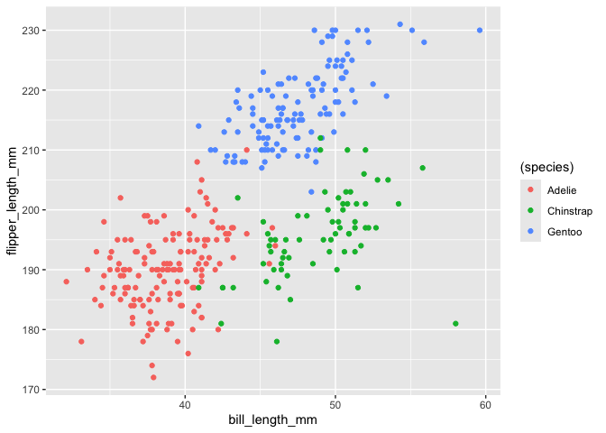

p8105_hw1_sy3269
================
Soomin You
2024-09-18

## Problem 0.1 and 0.2

This repo is for P8105 Homework 1.

``` r
library(tidyverse)
```

I loaded necessary packages (e.g. `tidyverse`).

## Problem 1

``` r
data("penguins", package = "palmerpenguins")
p_variable = names(penguins)
p_row = nrow(penguins)
p_col = ncol(penguins)

p_species = count(penguins, species)
```

There are 8 variables in penguins dataset and the names are species,
island, bill_length_mm, bill_depth_mm, flipper_length_mm, body_mass_g,
sex, year.

There are 3 species in the dataset and the names are Adelie, Chinstrap,
Gentoo.

There are 344 rows and 8 columns.

``` r
p_clean = na.omit(penguins)
mean_p_flipper = mean(p_clean[["flipper_length_mm"]])
```

Missing data were removed first to make a clean penguins dataset. Then
the mean flipper length of the clean dataset was found to be 200.966967
mm.

``` r
ggplot(p_clean, aes(x = bill_length_mm, y = flipper_length_mm, color = (species))) + 
  geom_point()
```

<!-- -->

``` r
ggsave("penguin scatterplot.pdf")
```

    ## Saving 7 x 5 in image

This is a scatterplot of the clean penguins dataset where x =
bill_length_mm and y = flipper_length_mm. The different species are
noted in different colors.
